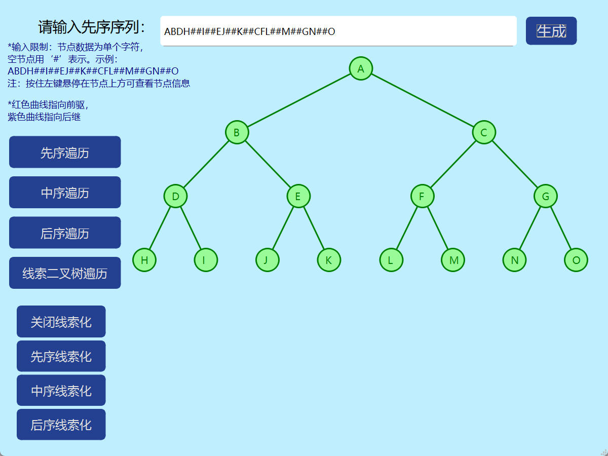
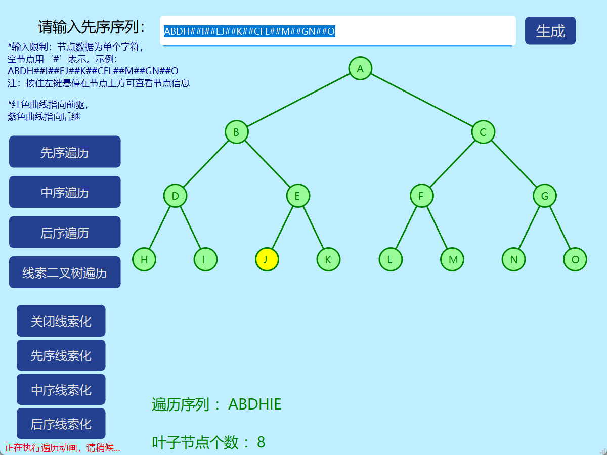
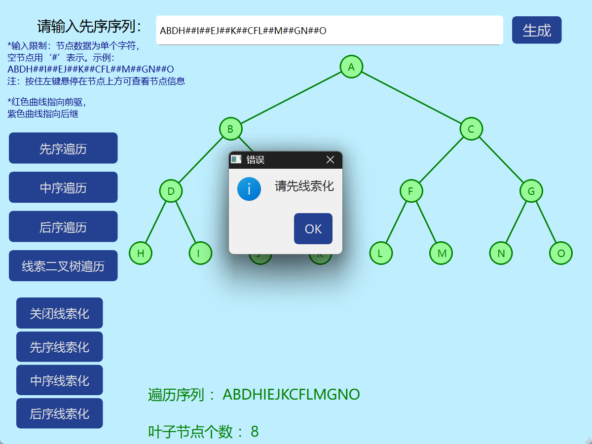
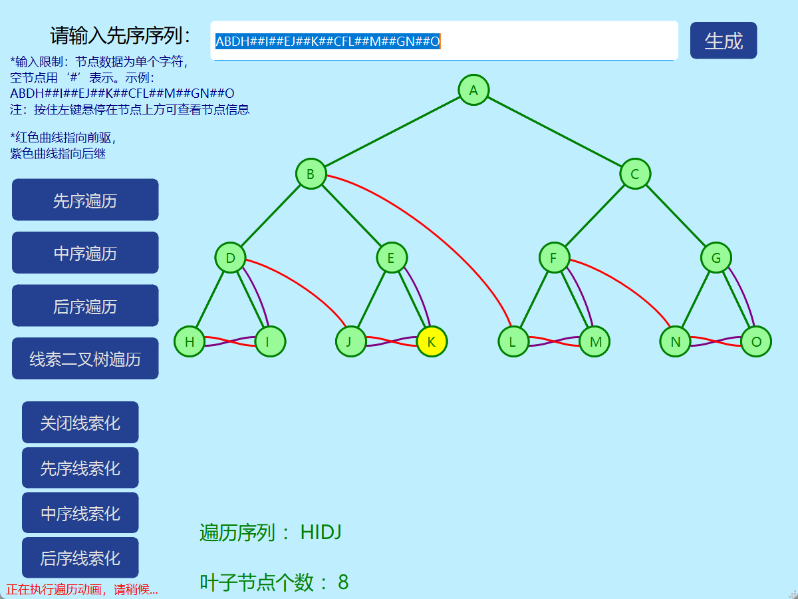
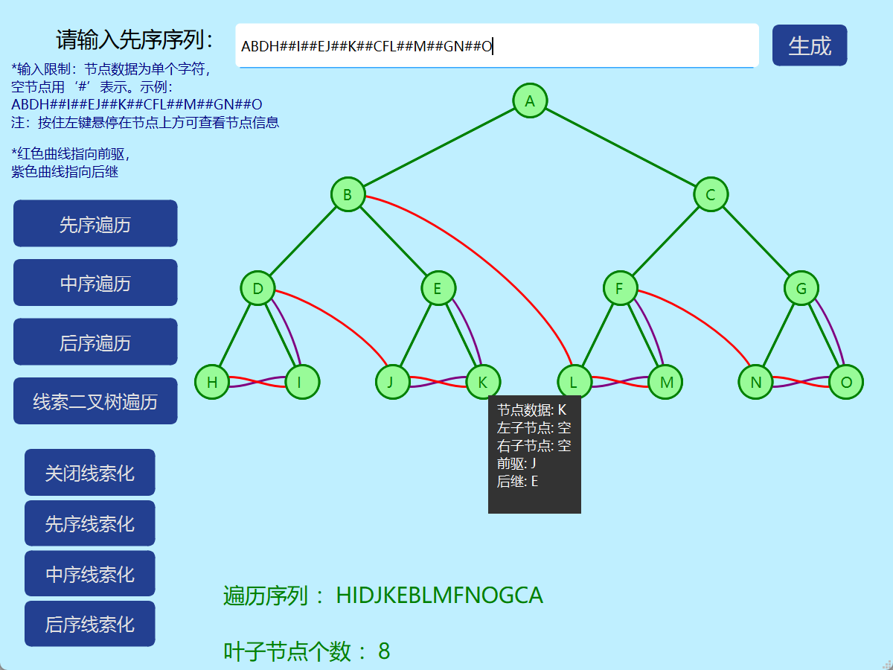

# 二叉树可视化
 本项目基于Qt实现简单的二叉树的先序、中序、后序遍历与线索化可视化。支持以先序序列方式输入二叉树。
 - demo文件夹下包含所有文件运行所需所有依赖，clone库到本地后直接双击demo/BT_Traversal.exe可查看演示效果

- 先序序列输入后生成二叉树如下图

- 点击左侧遍历按键可显示遍历动画，遍历后显示遍历序列和叶子节点个数。遍历过程中左下角中显示“正在执行遍历动画，请稍后”，同时用户无法进行其他按钮操作。

- 线索化默认为关闭状态，只有在线索化后才能进行线索二叉树遍历操作。

- 如下图，按住左键不松开，悬停在节点上方，可显示节点详细信息：

